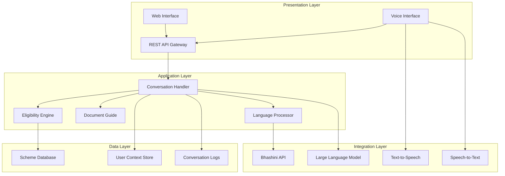

# Design Document: GramSahayak

## Overview

GramSahayak is designed as a modular, AI-powered conversational assistant that bridges the gap between Indian citizens and government welfare schemes. The system employs a microservices architecture with specialized components for natural language processing, eligibility assessment, multilingual support, and voice interaction. The design prioritizes accessibility, scalability, and cultural sensitivity while ensuring data privacy and security.

The system leverages modern conversational AI patterns with a focus on adjacency pairs (question-answer, request-response) to maintain predictable and repairable interactions. It integrates with India's Bhashini platform for multilingual capabilities and employs a hybrid approach combining rule-based eligibility engines with AI-powered natural language understanding.

## Architecture

The system follows a layered microservices architecture with clear separation of concerns:



### Key Architectural Principles

1. **Modularity**: Each component has a single responsibility and can be developed, tested, and deployed independently
2. **Language-First Design**: Multilingual support is built into the core architecture, not added as an afterthought
3. **Accessibility**: Voice interface and simple text interactions ensure broad accessibility
4. **Privacy by Design**: User context is session-based and automatically cleared
5. **Scalability**: Stateless services with external session management for horizontal scaling

## Components and Interfaces

### Conversation Handler

**Purpose**: Orchestrates all user interactions and maintains conversation flow

**Key Responsibilities**:
- Parse and understand user intents from natural language input
- Maintain conversation context and state
- Route requests to appropriate specialized components
- Generate coherent, contextual responses
- Handle conversation repair and clarification

**Interface**:
```typescript
interface ConversationHandler {
  processMessage(input: UserMessage, context: UserContext): Promise<Response>
  maintainContext(sessionId: string, context: UserContext): void
  clearSession(sessionId: string): void
  handleFallback(input: UserMessage): Promise<FallbackResponse>
}

interface UserMessage {
  text: string
  language: string
  sessionId: string
  timestamp: Date
  channel: 'text' | 'voice'
}

interface Response {
  text: string
  language: string
  suggestions?: string[]
  requiresFollowUp: boolean
  actionItems?: ActionItem[]
}
```

### Eligibility Engine

**Purpose**: Assesses user eligibility for government schemes based on provided context

**Key Responsibilities**:
- Evaluate user demographics against scheme criteria
- Rank eligible schemes by relevance and benefit potential
- Explain eligibility decisions and requirements
- Handle complex multi-criteria evaluations
- Provide alternative suggestions for ineligible users

**Interface**:
```typescript
interface EligibilityEngine {
  assessEligibility(context: UserContext): Promise<EligibilityResult[]>
  explainEligibility(schemeId: string, context: UserContext): Promise<Explanation>
  findAlternatives(context: UserContext, excludedSchemes: string[]): Promise<SchemeRecommendation[]>
}

interface EligibilityResult {
  schemeId: string
  eligible: boolean
  confidence: number
  missingRequirements?: string[]
  requiredDocuments?: Document[]
}

interface UserContext {
  age?: number
  income?: number
  occupation?: string
  state: string
  district?: string
  category?: 'General' | 'SC' | 'ST' | 'OBC'
  familySize?: number
  landOwnership?: boolean
}
```

### Document Guide

**Purpose**: Provides step-by-step application guidance and document requirements

**Key Responsibilities**:
- Generate sequential application workflows
- Specify document requirements and formats
- Provide office locations and contact information
- Track application deadlines and time-sensitive steps
- Offer multiple application channel options

**Interface**:
```typescript
interface DocumentGuide {
  generateApplicationGuide(schemeId: string, context: UserContext): Promise<ApplicationGuide>
  getDocumentRequirements(schemeId: string): Promise<DocumentRequirement[]>
  findNearbyOffices(location: Location, schemeId: string): Promise<OfficeInfo[]>
}

interface ApplicationGuide {
  steps: ApplicationStep[]
  estimatedTime: string
  deadlines: Deadline[]
  alternativeChannels: ApplicationChannel[]
}

interface ApplicationStep {
  stepNumber: number
  title: string
  description: string
  requiredDocuments: string[]
  estimatedDuration: string
  canBeCompletedOnline: boolean
}
```

### Language Processor

**Purpose**: Handles multilingual interactions and cultural localization

**Key Responsibilities**:
- Translate between supported Indian languages
- Maintain conversation context across language switches
- Localize content for regional preferences
- Handle technical term explanations
- Integrate with Bhashini platform for language services

**Interface**:
```typescript
interface LanguageProcessor {
  translate(text: string, fromLang: string, toLang: string): Promise<string>
  detectLanguage(text: string): Promise<string>
  localizeContent(content: Content, targetLanguage: string): Promise<LocalizedContent>
  explainTechnicalTerm(term: string, language: string): Promise<string>
}

interface LocalizedContent {
  text: string
  language: string
  culturalAdaptations: string[]
  alternativePhrasings?: string[]
}
```

### Voice Interface

**Purpose**: Enables voice-based interactions for accessibility

**Key Responsibilities**:
- Convert speech to text with Indian accent recognition
- Generate natural-sounding speech in multiple Indian languages
- Handle audio quality issues and background noise
- Provide voice control options (speed, volume)
- Integrate with device accessibility features

**Interface**:
```typescript
interface VoiceInterface {
  speechToText(audioData: AudioBuffer, language: string): Promise<string>
  textToSpeech(text: string, language: string, voiceSettings: VoiceSettings): Promise<AudioBuffer>
  detectAudioQuality(audioData: AudioBuffer): Promise<QualityMetrics>
}

interface VoiceSettings {
  speed: number // 0.5 to 2.0
  volume: number // 0.0 to 1.0
  voice: 'male' | 'female'
  accent?: string
}
```

## Data Models

### Scheme Model

```typescript
interface Scheme {
  id: string
  name: string
  nameTranslations: Record<string, string>
  description: string
  descriptionTranslations: Record<string, string>
  category: SchemeCategory
  eligibilityCriteria: EligibilityCriteria
  benefits: Benefit[]
  applicationProcess: ApplicationProcess
  documents: DocumentRequirement[]
  deadlines: Deadline[]
  contactInfo: ContactInfo
  status: 'active' | 'inactive' | 'suspended'
  lastUpdated: Date
}

interface EligibilityCriteria {
  ageRange?: { min: number; max: number }
  incomeRange?: { min: number; max: number }
  occupation?: string[]
  state?: string[]
  category?: string[]
  gender?: 'male' | 'female' | 'any'
  additionalCriteria: Record<string, any>
}

interface Benefit {
  type: 'financial' | 'service' | 'subsidy' | 'loan'
  amount?: number
  description: string
  frequency?: 'one-time' | 'monthly' | 'yearly'
}
```

### User Session Model

```typescript
interface UserSession {
  sessionId: string
  context: UserContext
  conversationHistory: ConversationTurn[]
  preferredLanguage: string
  startTime: Date
  lastActivity: Date
  isVoiceEnabled: boolean
}

interface ConversationTurn {
  timestamp: Date
  userInput: string
  systemResponse: string
  intent: string
  entities: Record<string, any>
  language: string
}
```

### Application Workflow Model

```typescript
interface ApplicationWorkflow {
  schemeId: string
  steps: WorkflowStep[]
  requiredDocuments: DocumentRequirement[]
  estimatedCompletionTime: string
  alternativeChannels: ApplicationChannel[]
}

interface WorkflowStep {
  id: string
  title: string
  description: string
  type: 'document_collection' | 'form_filling' | 'verification' | 'submission'
  dependencies: string[]
  canBeCompletedOnline: boolean
  estimatedTime: string
  helpText: string
}
```

Now I need to use the prework tool to analyze the acceptance criteria before writing the Correctness Properties section:

<function_calls>
<invoke name="prework">
<parameter name="featureName">gram-sahayak

## Correctness Properties

*A property is a characteristic or behavior that should hold true across all valid executions of a system—essentially, a formal statement about what the system should do. Properties serve as the bridge between human-readable specifications and machine-verifiable correctness guarantees.*

Based on the prework analysis of acceptance criteria, the following properties ensure GramSahayak operates correctly across all scenarios:

### Property 1: Query Processing Completeness
*For any* natural language query about government schemes, the Conversation_Handler should either provide relevant scheme information or ask clarifying questions to better understand the user's needs.
**Validates: Requirements 1.1, 1.5**

### Property 2: Conversation Context Preservation
*For any* conversation sequence with follow-up questions, the Conversation_Handler should maintain context and provide coherent responses that reference previous interactions.
**Validates: Requirements 1.2**

### Property 3: Intent Recognition Robustness
*For any* informal or colloquial language input, the Conversation_Handler should understand the underlying intent and respond appropriately, regardless of formality level.
**Validates: Requirements 1.3**

### Property 4: Multi-Scheme Presentation Clarity
*For any* query that matches multiple government schemes, the Conversation_Handler should present all relevant options in a clear, prioritized manner based on user context.
**Validates: Requirements 1.4**

### Property 5: Comprehensive Eligibility Assessment
*For any* user demographic profile, the Eligibility_Engine should assess eligibility across all available schemes and provide clear qualification status.
**Validates: Requirements 2.1, 2.2**

### Property 6: Ineligibility Explanation and Alternatives
*For any* user profile that doesn't meet scheme criteria, the Eligibility_Engine should explain why eligibility was not met and suggest alternative schemes when available.
**Validates: Requirements 2.3**

### Property 7: Dynamic Eligibility Updates
*For any* change in user context during a session, the Eligibility_Engine should update all eligibility assessments to reflect the new information.
**Validates: Requirements 2.4**

### Property 8: Document Requirement Specification
*For any* scheme that requires documentation, the Eligibility_Engine should specify exactly which documents are needed and their verification processes.
**Validates: Requirements 2.5**

### Property 9: Application Guidance Completeness
*For any* scheme with application requirements, the Document_Guide should provide a clear, sequential list of all required steps with appropriate detail.
**Validates: Requirements 3.1**

### Property 10: Document Format Specification
*For any* scheme requiring documents, the Document_Guide should specify exactly which documents are needed and their format requirements.
**Validates: Requirements 3.2**

### Property 11: Deadline Information Prominence
*For any* scheme with application deadlines, the Document_Guide should prominently display deadline information and identify time-sensitive steps.
**Validates: Requirements 3.3**

### Property 12: Application Channel Options
*For any* scheme with multiple application methods, the Document_Guide should present all available channels with their respective advantages and requirements.
**Validates: Requirements 3.4**

### Property 13: Location Information Provision
*For any* scheme requiring office visits, the Document_Guide should provide accurate location information and operating hours.
**Validates: Requirements 3.5**

### Property 14: Language Consistency
*For any* selected language preference, the Language_Processor should conduct all subsequent interactions in that language while maintaining conversation context across language switches.
**Validates: Requirements 4.1, 4.2**

### Property 15: Technical Term Localization
*For any* technical terms or scheme names without direct translations, the Language_Processor should provide clear explanations in the user's preferred language.
**Validates: Requirements 4.3**

### Property 16: Official Document Language Handling
*For any* official documents or forms, the Language_Processor should indicate official language requirements while providing translations where possible.
**Validates: Requirements 4.4**

### Property 17: Regional Language Prioritization
*For any* region with available dialect support, the Language_Processor should prioritize local dialects and terminology over generic language variants.
**Validates: Requirements 4.5**

### Property 18: Voice Interface Round-Trip Accuracy
*For any* voice input, the Voice_Interface should accurately convert speech to text and then convert responses back to natural-sounding speech, maintaining meaning throughout the round-trip.
**Validates: Requirements 5.1, 5.2**

### Property 19: Voice Error Handling
*For any* unclear or noisy voice input, the Voice_Interface should request clarification rather than processing potentially incorrect information.
**Validates: Requirements 5.3, 5.4**

### Property 20: Voice Control Availability
*For any* voice-enabled session, the Voice_Interface should allow users to control speech rate and volume settings.
**Validates: Requirements 5.5**

### Property 21: Scheme Data Integrity
*For any* scheme data operation (create, update, discontinue), the Scheme_Database should maintain data integrity, preserve version history, and provide the most current information when accessed.
**Validates: Requirements 6.1, 6.2, 6.3, 6.4**

### Property 22: Data Inconsistency Detection
*For any* data discrepancies detected in the Scheme_Database, the system should flag inconsistencies for administrative review.
**Validates: Requirements 6.5**

### Property 23: Session Context Management
*For any* user session, the GramSahayak should store personal information for the session duration, use it for assessments without re-entry, and clear it when the session ends.
**Validates: Requirements 7.1, 7.2, 7.3**

### Property 24: Context Modification Capability
*For any* user request to update personal information, the GramSahayak should allow modification of stored context within the session.
**Validates: Requirements 7.4**

### Property 25: Sensitive Data Confirmation
*For any* sensitive information provided by users, the GramSahayak should request explicit confirmation before storing or using such data.
**Validates: Requirements 7.5**

### Property 26: Graceful Error Handling
*For any* system error, incomprehensible query, or unavailable information, the GramSahayak should provide user-friendly responses with suggestions for resolution or alternative resources.
**Validates: Requirements 8.1, 8.2, 8.3**

### Property 27: Performance Degradation Communication
*For any* system performance issues, the GramSahayak should inform users of delays and provide estimated resolution times.
**Validates: Requirements 8.4**

### Property 28: Human Support Escalation
*For any* scenario where the system cannot provide adequate assistance, the GramSahayak should offer to connect users with human support or official helplines.
**Validates: Requirements 8.5**

## Error Handling

The system implements a multi-layered error handling strategy:

### Input Validation Layer
- Sanitize and validate all user inputs before processing
- Handle malformed queries gracefully with helpful suggestions
- Detect and prevent injection attacks or malicious inputs

### Service Layer Error Handling
- Implement circuit breakers for external service calls (Bhashini, LLM APIs)
- Provide fallback responses when AI services are unavailable
- Log errors with appropriate detail levels for debugging

### User Experience Layer
- Convert technical errors into user-friendly messages
- Provide actionable suggestions for error recovery
- Maintain conversation flow even when errors occur
- Offer alternative interaction methods when primary channels fail

### Data Consistency Layer
- Implement transaction rollbacks for data integrity issues
- Validate scheme data before updates
- Handle concurrent access to user sessions safely

## Testing Strategy

GramSahayak employs a comprehensive dual testing approach combining unit tests for specific scenarios with property-based tests for universal correctness validation.

### Property-Based Testing
Property-based tests validate the universal properties defined above using randomized inputs to ensure correctness across all possible scenarios. Each property test will:

- Run a minimum of 100 iterations with randomized inputs
- Generate diverse test data including edge cases
- Validate the property holds across all generated scenarios
- Use appropriate generators for Indian demographic data, language variations, and scheme configurations

**Property Test Configuration:**
- Testing Framework: Choose appropriate PBT library for the target language
- Minimum Iterations: 100 per property test
- Test Tagging: Each test tagged with **Feature: gram-sahayak, Property {number}: {property_text}**
- Data Generators: Custom generators for Indian names, languages, demographic profiles, and government scheme data

### Unit Testing
Unit tests complement property tests by validating specific examples, integration points, and edge cases:

**Focus Areas:**
- API endpoint integration testing
- Database query correctness
- External service integration (Bhashini, speech services)
- Authentication and session management
- Error boundary testing with specific error conditions

**Testing Balance:**
- Property tests handle comprehensive input coverage and universal correctness
- Unit tests focus on specific examples, integration scenarios, and concrete edge cases
- Both approaches together ensure complete coverage without redundancy

### Integration Testing
- End-to-end conversation flows in multiple languages
- Voice interface integration with speech services
- Database consistency across concurrent sessions
- Performance testing under load with multiple simultaneous users

### Accessibility Testing
- Screen reader compatibility testing
- Voice interface testing with various accents and speech patterns
- Keyboard navigation testing for web interface
- Testing with users having different digital literacy levels